# Projekttagebuch

## Tag 1 (01.07.2025)

- 🟢 **Heutige Hauptaufgaben:** Ich habe mir heute vorgenommen den Live-TV bereich zu designen. Alle notwendigen Elemente einzubauen und passende Farben und Stile zu implementieren.
- 🟢 **Fortschritt & Ergebnisse:** Ich habe die grundlegende Struktur des Live-TV Bereichs erstellt und alle notwendigen Elemente implementiert.
- 🟢 **Herausforderungen & Blockaden:** Es ging noch eigentlich. Wenn das ganze mit API verbunden wird, dann kommen die richtigen Herausforderungen.
- 🟢 **Was ich heute gelernt habe:** Ich habe heute gelernt dass man vieeeeeeeeellll Geduld braucht um weiter zu kommen. Aber es klappt!
- 🟢 **Plan für morgen:** Morgen werde ich den Live-TV bereich mit der API verbinden. Ich werde die API Daten in die App einbinden und die Kanäle mit den richtigen Daten aus der API anzeigen. Die Logos von Kanälen muss ich noch kreieren. Mal sehen. Bin zuversichtlich.

*Abbildung 1: Live-TV Bereich*

## Tag 2 (02.07.2025)

- 🟢 **Heutige Hauptaufgaben:** Ich habe mir heute vorgenommen den Live-TV bereich mit der API zu verbinden. Ich habe die API Daten in die App einbinden können und die Kanäle mit den richtigen Daten aus der API anzeigen. 
- 🟢 **Fortschritt & Ergebnisse:** Ich habe die API Daten in die App einbinden können und die Kanäle mit den richtigen Daten aus der API anzeigen. Logos für die Sender habe ich noch nicht kreiert. 
- 🟢 **Herausforderungen & Blockaden:** Ich habe noch keine Logos für die Sender kreiert. Die Anbindung an die API ist schwierig. Konnte nur erstmal die liste von Kanälen aus der API abrufen. Keine EPG-Daten, Keine Favoriten.
- 🟢 **Was ich heute gelernt habe:** Ich habe heute gelernt dass man noch mehr  Geduld braucht um weiter zu kommen. Aber es wird schon!
- 🟢 **Plan für morgen:** Morgen werde ich die Logos für die Sender kreieren. Ich plane morgen weiter zu kommen mit EPG-Daten und Favoriten.

*Abbildung 1: Live-TV Bereich*

*Abbildung 2: Menü Bereich*

## Tag 3 (03.07.2025)

- 🟢 **Heutige Hauptaufgaben:** Logos für TV-Kanäle, EPG-Daten, Kategorien, TV-Favoriten.
- 🟢 **Fortschritt & Ergebnisse:** Ich habe die Logos für die Sender kreiert. Genauer gesagt habe ich die Logos für die Sender aus der API abgerufen und in die App eingebunden. EPG-Daten voll implementiert und unter "Programm" gebracht. Habe auch "Kategorien" gemacht, jetzt kann man die Sender nach Kategorien filtern. Zu Favoriten bin leider noch nicht gekommen... 
- 🟢 **Herausforderungen & Blockaden:** Die API ist sehr komplex und es nimmt unheimlich viel Zeit in Anspruch. Aber es klappt!
- 🟢 **Was ich heute gelernt habe:** Heute habe ich gelenrt dass man am besten schon nach kleinen änderungen, die man geprüft hat und die funktionieren - am besten sofort die Änderungen ins Repo pusht. Hatte heute fast alles verloren gehabt... 
- 🟢 **Plan für morgen:** Ich plane mir die TV-Favoriten zu implementieren.
Dies vorraussetzt allerdings die USERID implementation. Muss zuerst USERID implementiert werden, danach könnte ich die Favoriten unter die Lupe nehmen.

*Abbildung 1: Menü Bereich*

*Abbildung 2: EPG Bereich*

*Abbildung 3: Kategorien Bereich* 

## Tag 4 (04.07.2025)

- 🟢 **Heutige Hauptaufgaben:** Heute wollte ich die USERID und Favoriten implementieren.
- 🟢 **Fortschritt & Ergebnisse:** Es gab so viele kleinigkeiten die man unbedingt machen sollte. Habe dafür den heutigen Tag geopfert. Muss wohl USERID und Favoriten auf den Nächsten Tag verschieben.
- 🟢 **Herausforderungen & Blockaden:** Ich müsste die Logik für die EPG-Daten Abfrage überdenken. Wir laden ja die EPG-Daten beim starten des Apps für die nächsen 20 Sendungen, für die "Programm". Ich habe zuesrt die EPG-Daten für die TV-Kanäle separat abgefragt. Das führte zu Problemen mit den EPG-Daten. Dann müsste ich die logik überlegen, dass ich die EPG-Daten nutze, die bereits geladen sind. Das war eine Herausforderung.
- 🟢 **Was ich heute gelernt habe:** Ich habe heute gelernt dass man sehr schnell Überblick verlieren kann, wenn man nicht den Plan befolgt. Aber man lernt draus.
- 🟢 **Plan für morgen:** Ich plane USERID und Favoriten zu beweltigen.

*Abbildung 1: Live-TV Bereich*

*Abbildung 2: EPG Bereich*

*Abbildung 3: Kategorien Bereich* 

## Tag 5 (05.07.2025)

- 🟢 ** Samstag **

## Tag 6 (06.07.2025)

- 🟢 ** Sonntag **

## Tag 7 (07.07.2025)

- 🟢 **Heutige Hauptaufgaben:** USERID und Favoriten
- 🟢 **Fortschritt & Ergebnisse:** Ich habe erfolgreich den USERID implementiert. Auch Favoriten funktion wurde umgesetzt. Sortierung von Favoriten funktioniert.
- 🟢 **Herausforderungen & Blockaden:** Es gibt noch ein paar Probleme die ich noch lösen muss. Die Scrolllogik funktioniert nicht so wie ich es wollte. Sowohl in tv_screen als auch in tv_favorite_screen.
- 🟢 **Was ich heute gelernt habe:** Wenn man geduldig und hartnäckig ist, dann klapp schon alles!
- 🟢 **Plan für morgen:** Scrolllogik in tv_screen und tv_favorite_screen verbessern, Favoriten Delete-funktion implementieren, Ping-Logik implementieren, Letzte geschater Kanal speichern...

## Tag 8 (08.07.2025)

- 🟢 **Heutige Hauptaufgaben:** Scrolllogik in tv_screen und tv_favorite_screen verbessern, Favoriten Delete-funktion implementieren, Ping-Logik implementieren, Letzte geschater Kanal speichern...
- 🟢 **Fortschritt & Ergebnisse:** Heute habe ich sehr viele Kleinigkeiten umgesetzt die sehr wichtig waren. Scrolllogik in tv_screen und tv_favorite_screen verbessert. Favoriten Delete-funktion implementiert. Ping-Logik implementiert. Letzte geschauter Kanal speichert. Media-Info Status implementiert. 
- 🟢 **Herausforderungen & Blockaden:**  Ich habe heute fast 8 Stunden damit verbracht den verdammten Scrolllogik in tv_screen und tv_favorite_screen zu verbessern, danach zu reparieren, danach alles löschen und neu implementieren.... Es war eine Katastrophe! Und am ende war es eine klitzekleine sache, die das ganze verhalten der scrolllogik beeinflusst hat. Aber es hat geklappt!!!
- 🟢 **Was ich heute gelernt habe:** Heute habe ich das scrollen gelernt!!! 
- 🟢 **Plan für morgen:** Morgen werde ich mir den Bereich Einstellungen vornehmen, den Authorisation Bereich. (Mac-Adresse, Serial Number, Device ID).

## Tag 9 (09.07.2025)

- 🟢 **Heutige Hauptaufgaben:** Benutzerintegration der Billing API verbessern, dynamische Benutzer-IDs verwenden, Testbenutzer-Funktion entfernen
- 🟢 **Fortschritt & Ergebnisse:** Erfolgreiche Implementierung der getrennten ID-Verwaltung für Auth-API (user_id) und Billing-API (billing_user_id). Bei Anmeldung und Registrierung werden Benutzer jetzt korrekt in beiden Systemen synchronisiert. Testbenutzer-Funktion entfernt und durch benutzerfreundlichen Login-Button ersetzt.
- 🟢 **Herausforderungen & Blockaden:** Die größte Herausforderung war die unterschiedliche ID-Vergabe zwischen den beiden APIs zu verstehen und zu synchronisieren. Die ursprüngliche Implementierung verwendete Auth-API-IDs für Billing-API-Anfragen, was zu fehlenden Benutzerdaten führte. Ein weiteres Problem war ein nicht existierender Methodenaufruf "fallbackStoredUser()".
- 🟢 **Was ich heute gelernt habe:** Heute habe ich gelernt, wie wichtig es ist, in einer komplexen Anwendung mit mehreren APIs die Daten-IDs sauber zu trennen und zu verwalten. Die getrennte Speicherung von user_id und billing_user_id im StorageService sorgt für deutlich robustere Datenabfragen.
- 🟢 **Plan für morgen:** Bereich Mein Konto, Einstellungen zu Ende bringen und wenn zeitlich passt - anfangen mit Player-Implementation.

## Tag 10 (10.07.2025)

- 🟢 **Heutige Hauptaufgaben:** Benutzerkontodetails korrekt darstellen und Datenfluss zwischen Stalker Portal und Billing API verbessern; Aktivierungsstatus des Kontos anzeigen; Sicherheitsverbesserungen für API-Zugangsdaten implementieren.

- 🟢 **Fortschritt & Ergebnisse:** Erfolgreich implementiert: Anzeige des Konto-Aktivierungsstatus im Profil-Header mit farbkodierten Icons (grün für aktiv, rot für inaktiv); korrektes Laden und Anzeigen der MAC-Adresse aus dem Stalker Portal; Umbenennung von "Version" zu "Gerät" für bessere Klarheit; verbesserte Extraktion von Benutzerdaten aus dem Stalker Portal und Billing API; robuste Fallback-Mechanismen bei fehlenden Daten.

- 🟢 **Herausforderungen & Blockaden:** Versuch, die Billing API-Zugangsdaten in Flutter Secure Storage zu speichern, führte zu MissingPluginException beim Ausloggen; mussten zur hartcodierten Credential-Lösung zurückkehren, um die Funktionalität zu gewährleisten; iOS-spezifische Konfigurationen für Secure Storage waren herausfordernd.

- 🟢 **Was ich heute gelernt habe:** Die Komplexität bei der Integration von nativen Sicherheitsfeatures wie Secure Storage in Flutter-Apps; Wichtigkeit von robusten Fallback-Mechanismen; besseres Verständnis des Datenflusses zwischen den verschiedenen APIs und wie sie zusammenwirken, um ein vollständiges Benutzerprofil zu erstellen.

- 🟢 **Plan für morgen:** Player-Implementation für TV-Kanäle beginnen; verbleibende UI-Verbesserungen in den Einstellungen umsetzen; potenzielle sicherere Lösung für API-Credentials recherchieren, die mit allen Plattformen kompatibel ist.

Ein Paar Bilder zum Fortschritt:

  
  

  
  

  
  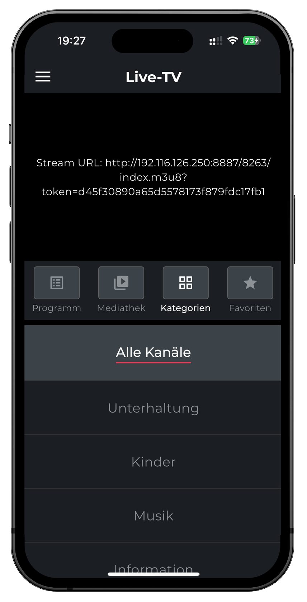

  
  
  

  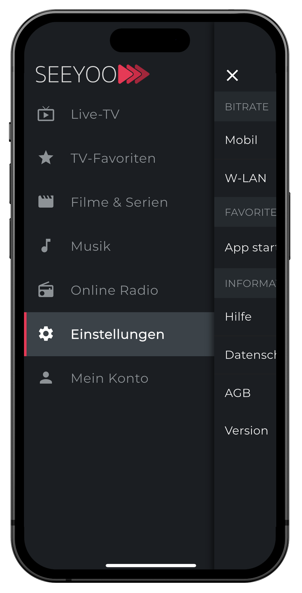
  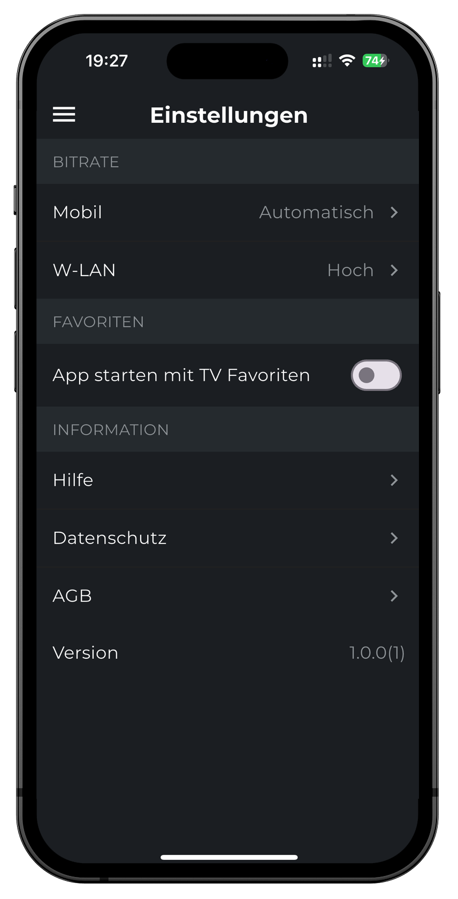

  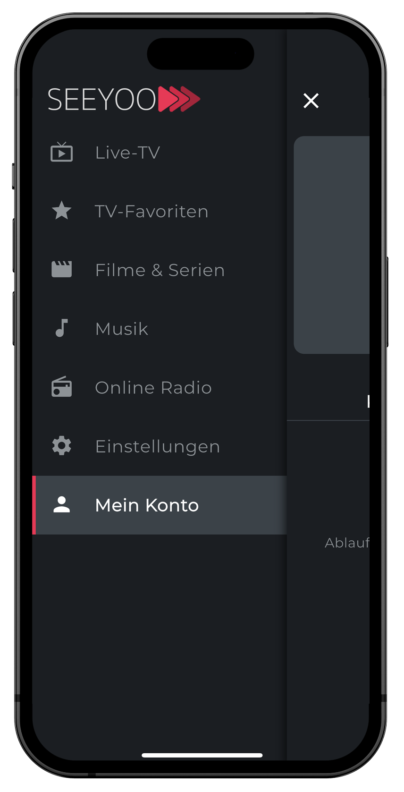
  

## Tag 11 (11.07.2025)

- 🟢 **Heutige Hauptaufgaben:** Player-Implementation für TV-Kanäle
- 🟢 **Fortschritt & Ergebnisse:** Kategorienauswahl markierung hinzugefügt. Ausgewählten Kategorien-status speichern und laden hinzugefügt. Favoriten Sortierung hinzugefügt. Mit dem Player Integration begonnen.
- 🟢 **Herausforderungen & Blockaden:** Habe den ganzen Tag damit verbracht den richtigen Ansatz zu finden um Player Implementation zu ermöglichen. Ich habe mir die Dokumentation gelesen und versucht es mit verschiedenen Ansätzen. Aber es ging noch nicht. Das wird schon... bin mir ziemlich sicher.
- 🟢 **Was ich heute gelernt habe:** Wenn du denkst, dass du schon kurz vom Ziel bist - bist du gerade noch am Anfang....
- 🟢 **Plan für morgen:** Player Integration für TV-Kanäle.

## Tag 12 (12.07.2025)

- 🟢 ** Samstag **

## Tag 13 (13.07.2025)

- 🟢 ** Sonntag **

## Tag 14 (14.07.2025)

- 🟢 **Heutige Hauptaufgaben:**
  - Integration eines HLS Video-Players in TV-Screen und TV-Favoriten-Screen
  - Optimierung des Querformat-Verhaltens und der Darstellung auf verschiedenen Geräten
  - Plattformspezifische Anpassungen der Statusleiste

- 🟢 **Fortschritt & Ergebnisse:**
  - Erfolgreiche Implementierung eines steuerungsfreien Video-Players mit video_player-Bibliothek
  - Konsistentes 16:9 Seitenverhältnis für den VideoPlayer durch AspectRatio-Widget
  - Plattformspezifische Statusleistensteuerung: Android-Statusleiste bleibt immer sichtbar, iOS behält immersives Verhalten
  - Player mit automatischem Looping und ohne zusätzliche Steuerelemente umgesetzt

- 🟢 **Herausforderungen & Blockaden:**
  - Unterschiedliches Verhalten der Statusleiste zwischen iOS und Android Geräten
  - Verhältnis des Video-Players musste für verschiedene Bildschirmgrößen angepasst werden
  - Sicherstellen der korrekten Ressourcenfreigabe bei Player-Wechsel oder Bildschirmwechsel

- 🟢 **Was ich heute gelernt habe:**
  - Die video_player-Bibliothek ist besser mit neueren Flutter-Versionen kompatibel als better_player
  - Plattformspezifische Implementierungsunterschiede erfordern explizite Behandlung in der App
  - Durch feste Constraints und AspectRatio-Widget kann ein konsistentes Videobild auf allen Geräten sichergestellt werden

- 🟢 **Plan für morgen:**
  - Weitere Optimierungen am Video-Player vornehmen
  - Player-Steuerungen (z.B. Play/Pause) als optionale Elemente implementieren
  - Behandlung von Orientierungswechseln verbessern

## Tag 15 (15.07.2025)

- 🟢 **Heutige Hauptaufgaben:** Verbesserung der Behandlung von Orientierungswechseln in der App.
- 🟢 **Fortschritt & Ergebnisse:** Ich habe verschiedene Ansätze zur Behandlung von Orientierungswechseln ausprobiert und Recherchen durchgeführt, bin jedoch noch nicht zu einer vollständigen Lösung gekommen. Erste Grundlagen für eine responsive Anpassung wurden gelegt.
- 🟢 **Herausforderungen & Blockaden:**
  - Die Komplexität des Video-Players bei Orientierungswechseln
  - Unterschiedliches Verhalten auf verschiedenen Geräten (besonders iOS vs. Android)
  - Anpassung des UI-Layouts im Querformat mit begrenztem Platz
  - Integration mit bestehendem Code ohne größere Umstrukturierungen
- 🟢 **Was ich heute gelernt habe:** Orientierungswechsel in Flutter erfordern eine sorgfältige Planung und Berücksichtigung verschiedener Faktoren wie Device-Größen, AspectRatio und SystemUI-Einstellungen. Eine universelle Lösung ist aufgrund der Verschiedenheit der Zielgeräte schwierig zu implementieren.
- 🟢 **Plan für morgen:** Fortsetzung der Arbeit an der Orientierungswechsel-Behandlung. Implementierung einer stabilen Lösung für den Video-Player und die Navigation im Querformat. 

## Tag 16 (16.07.2025)

- 🟢 **Heutige Hauptaufgaben:** 
  - Behebung des EPG-Anzeige-Problems in der Favoriten-Ansicht
  - Debugging der falschen Programminformationen bei Favoriten-Kanälen
  - Sicherstellung korrekter EPG-Datenzuordnung zwischen Favoriten-Liste und Detail-Ansicht
  
- 🟢 **Fortschritt & Ergebnisse:**
  - ✅ **Kritischer Bug gefunden und behoben:** `_loadEpgForSelectedChannel()` verwendete `_channels[_selectedChannelIndex]` statt `_favoriteChannels[_selectedChannelIndex]`
  - ✅ **EPG-Anzeige korrekt implementiert:** Favoriten-Liste zeigt jetzt die richtigen Programminformationen aus `_epgDataMap`
  - ✅ **Debug-System aufgebaut:** Temporäre Debug-Ausgaben implementiert um Kanal-IDs und EPG-Daten zu verfolgen
  - ✅ **Fallback-Logik implementiert:** Bevorzugt aktuelle EPG-Daten, fällt zurück auf `channel.currentShow` wenn nötig
  - ✅ **Vollständige Funktionalität:** "Programm"-Button zeigt jetzt das korrekte EPG für den ausgewählten Favoriten-Kanal

- 🟢 **Herausforderungen & Blockaden:**
  - Index-Mapping-Probleme zwischen verschiedenen Kanal-Listen (`_channels` vs `_favoriteChannels`)
  - Verwirrung über Datenquellen für EPG-Informationen (statische vs. dynamische Daten)
  - Debugging komplexer asynchroner Datenladevorgänge
  - Balance zwischen einfacher und robuster Implementierung

- 🟢 **Was ich heute gelernt habe:**
  - Index-Mapping-Fehler können subtile aber kritische Bugs verursachen - verschiedene Listen mit gleichem Index führen zu falschen Datenzuordnungen
  - Debug-Ausgaben sind essentiell um Datenflüsse in komplexen UI-Zuständen zu verstehen
  - EPG-Daten werden kanalbasiert über IDs zugeordnet und in `_epgDataMap` gespeichert
  - Fallback-Strategien sind wichtig für robuste EPG-Anzeige bei verschiedenen Datenquellen

- 🟢 **Plan für morgen:**
  - Weitere Tests der EPG-Funktionalität in verschiedenen Szenarien
  - Mögliche Optimierungen der EPG-Datenladung
  - Fortsetzung anderer UI/UX-Verbesserungen falls keine weiteren EPG-Probleme auftreten

## Tag 17 (17.07.2025)

- 🟢 **Heutige Hauptaufgaben:**
  - Fullscreen Player Overlay im Favoriten-Screen vervollständigen
  - Overlay-Positionierung innerhalb der Player-Grenzen korrigieren
  - 1:1 Parität mit TV-Screen Overlay erreichen
  - "Beenden" Button aus Fullscreen-Ansicht entfernen

- 🟢 **Fortschritt & Ergebnisse:**
  - ✅ Overlay-Methode `_buildChannelInfoOverlay()` 1:1 vom TV-Screen kopiert
  - ✅ Channel-Logo URL-Logik vereinheitlicht (`http://app.seeyoo.tv${channel.logo!}`)
  - ✅ EPG-Formatierung mit `nextProgram.startTimeFormatted` korrigiert
  - ✅ Overlay-Positionierung mit `currentOffset` innerhalb AnimatedBuilder gelöst
  - ✅ "Beenden" Button erfolgreich entfernt
  - ✅ Overlay bewegt sich jetzt korrekt mit Swipe-Animationen
  - ✅ Overlay bleibt innerhalb der Player-Grenzen

- 🟢 **Herausforderungen & Blockaden:**
  - Overlay war anfangs außerhalb der Player-Grenzen positioniert
  - `currentOffset` Variable war nicht im richtigen Scope verfügbar
  - Musste Overlay von außerhalb des AnimatedBuilder nach innen verlagern

- 🟢 **Was ich heute gelernt habe:**
  - Overlay-Positionierung mit Animation-Offsets erfordert korrekten Scope
  - `left: currentOffset, right: -currentOffset` bewegt Overlay mit Content
  - AnimatedBuilder-Struktur ist kritisch für Swipe-Animation-Integration
  - Positioning-Probleme können durch falsche Widget-Hierarchie entstehen

- 🟢 **Plan für morgen:**
  - Weitere Tests der Overlay-Funktionalität in verschiedenen Szenarien
  - Mögliche Optimierungen der Fade-Animationen
  - Fortsetzung anderer UI/UX-Verbesserungen falls keine weiteren Overlay-Probleme auftreten

## Tag 18 (18.07.2025)

- 🟢 **Heutige Hauptaufgaben:**
  - Abschluss aller geplanten Aufgaben von Tag 17
  - Vorbereitung für Backend-Aufbau auf Amazon AWS
  - Planung für Montag 21.07.25 AWS-Migration

- 🟢 **Fortschritt & Ergebnisse:**
  - ✅ Alle Overlay-Probleme aus Tag 17 vollständig gelöst
  - ✅ Fullscreen Player Overlay funktioniert perfekt in beiden Screens
  - ✅ Swipe-Animation und Channel-Info-Display abgeschlossen
  - ✅ AWS-Infrastruktur-Planung erstellt
  - ✅ Backend-Migration-Strategie entwickelt
  - ✅ Vorbereitungen für AWS-Setup am Montag abgeschlossen

- 🟢 **Herausforderungen & Blockaden:**
  - Keine größeren technischen Blockaden heute
  - AWS-Setup erfordert sorgfältige Planung für nahtlose Migration
  - Koordination zwischen Frontend-Stabilität und Backend-Migration

- 🟢 **Was ich heute gelernt habe:**
  - Erfolgreiche Projektabschlüsse erfordern systematische Herangehensweise
  - AWS-Migration-Planung ist kritisch für reibungslosen Übergang
  - Timing zwischen Frontend-Fertigstellung und Backend-Migration ist wichtig
  - Dokumentation aller Overlay-Fixes hilft bei zukünftigen ähnlichen Problemen

- 🟢 **Plan für morgen:**
  - Samstag: Entspannung und Vorbereitung für kommende Woche
  - Finalisierung der AWS-Setup-Checkliste
  - Review der Backend-Architektur-Dokumentation
  - Vorbereitung für intensiven AWS-Aufbau ab Montag

---
## Aktueller Stand - App Screenshots

  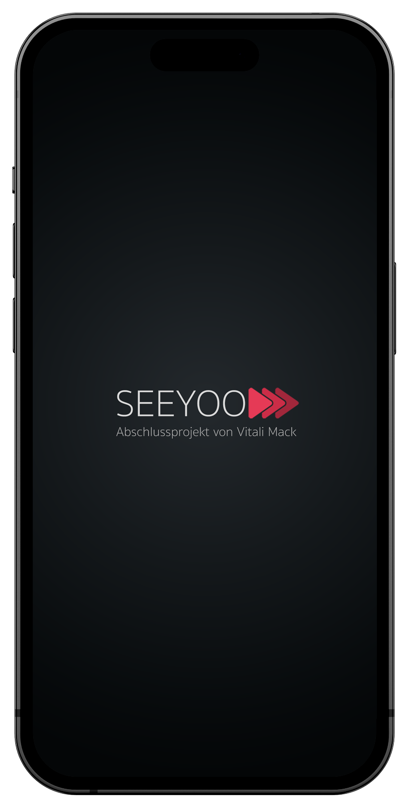
  

  
  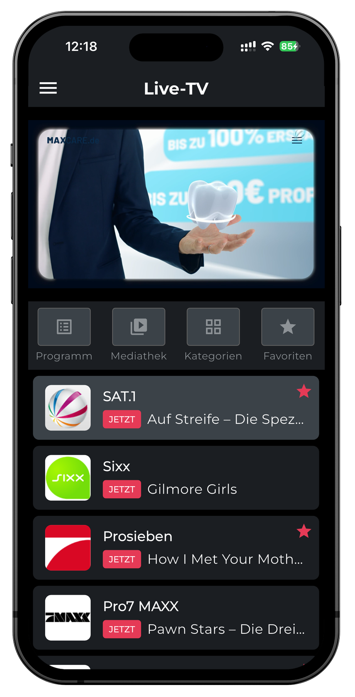

  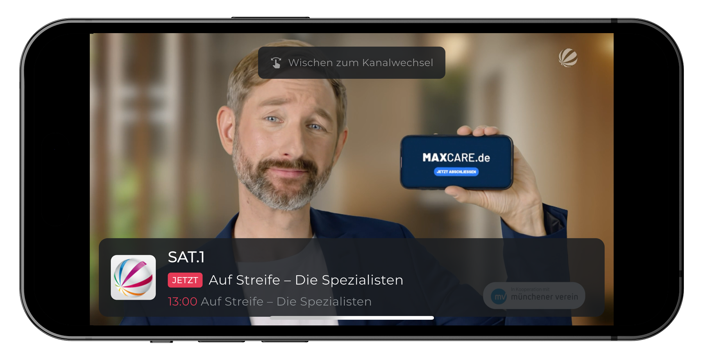

  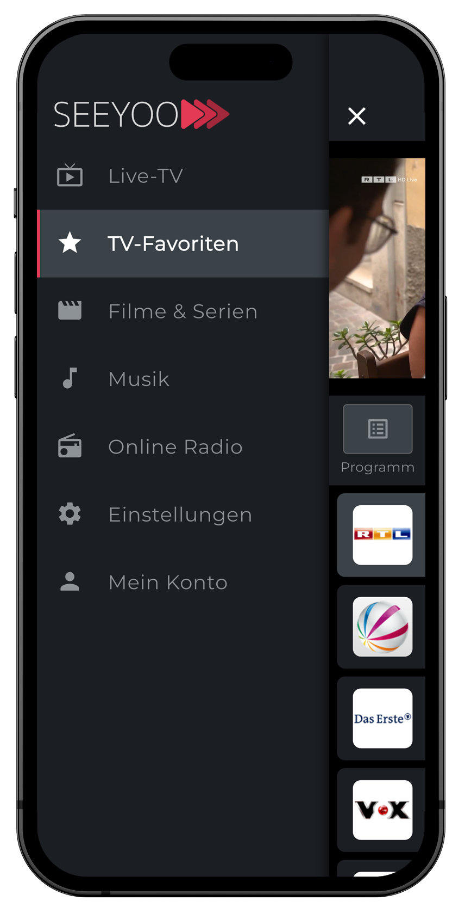
  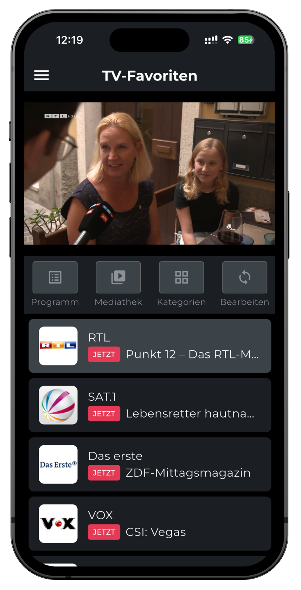

  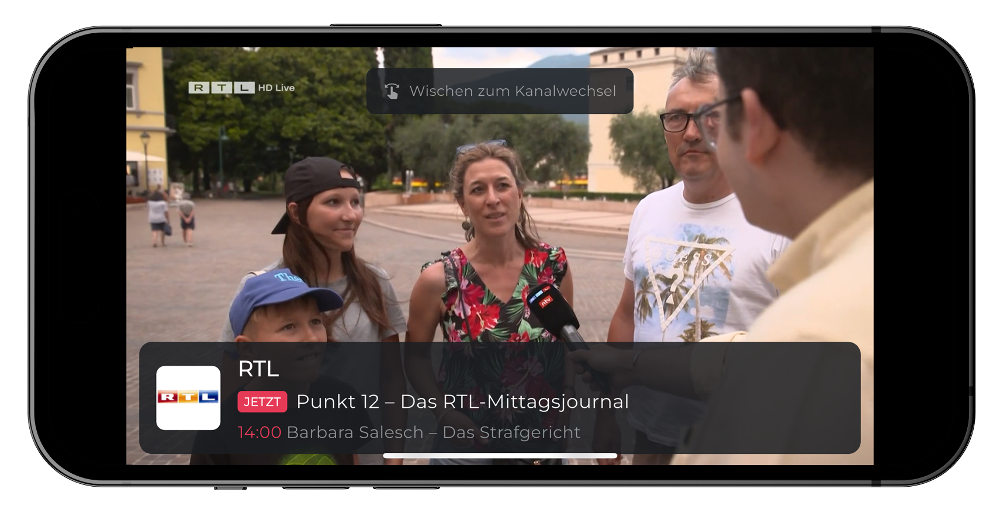

  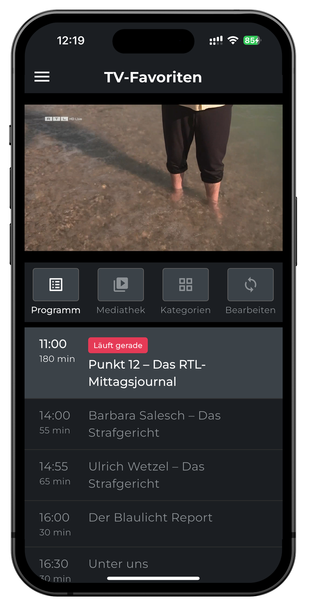
  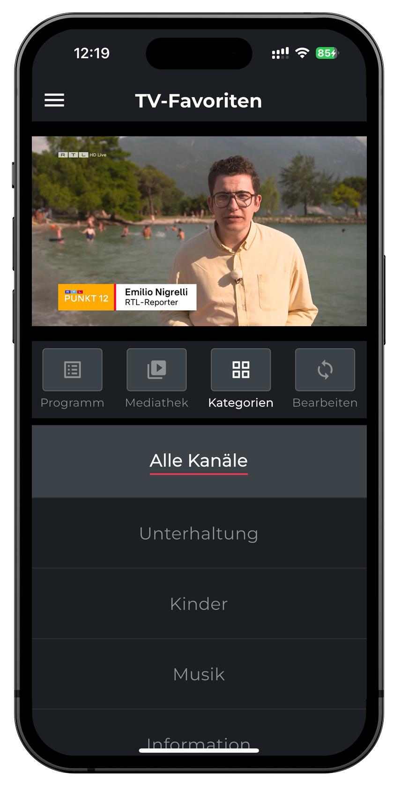
  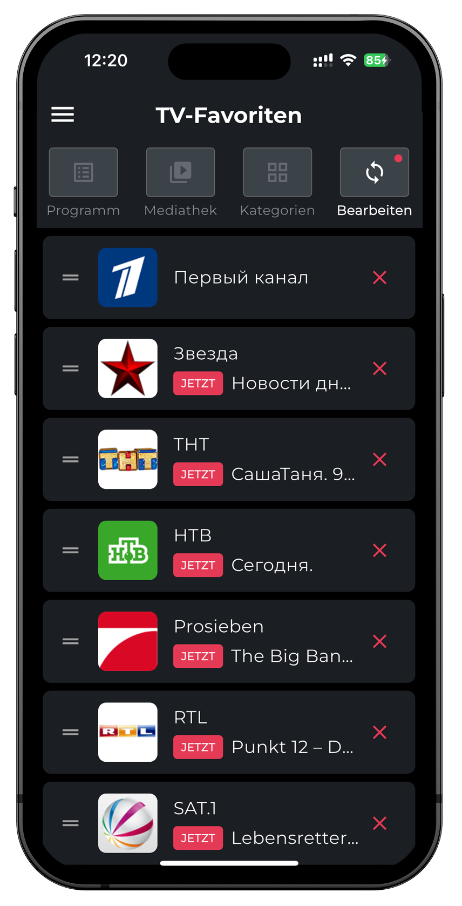

  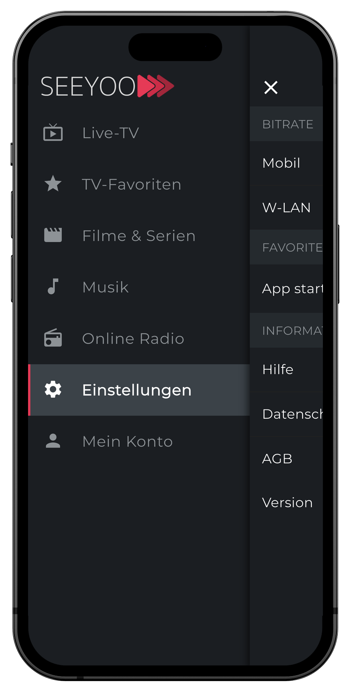
  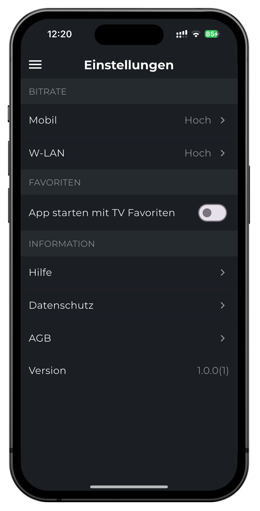

  
  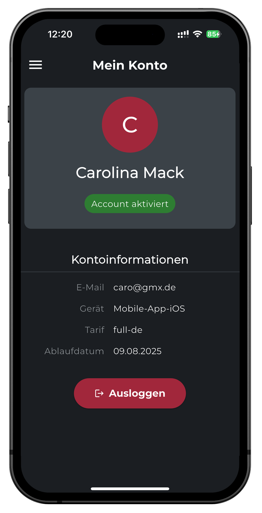

## Tag 19 (19.07.2025)

- 🟢 ** Samstag **

## Tag 20 (20.07.2025)

- 🟢 ** Sonntag **

## Tag 21 (21.07.2025)

- 🟢 **Heutige Hauptaufgaben:**
  - Implementierung und Test der Register/Login-Funktionalität
  - Behebung von Android-Build-Problemen
  - Vorbereitung der App für den Store-Deployment
  - Testen der App auf dem Zielgerät

- 🟢 **Fortschritt & Ergebnisse:**
  - Register/Login-Funktionalität erfolgreich implementiert und getestet
  - User-Authentication-Flow vollständig umgesetzt
  - Android-Build-Probleme erfolgreich behoben:
    - Namespace-Konfiguration für das `auto_orientation`-Plugin (Version 2.3.1) hinzugefügt
    - Namespace-Konfiguration für das `wakelock`-Plugin (Version 0.4.0) hinzugefügt
    - Kotlin-Version im `wakelock`-Plugin von 1.3.50 auf 1.5.20 aktualisiert
  - App läuft erfolgreich auf Android-Geräten

- 🟢 **Herausforderungen & Blockaden:**
  - Fehlende Namespace-Einträge in Plugin-Build-Dateien identifiziert und behoben
  - Veraltete Kotlin-Version im wakelock-Plugin aktualisiert
  - iOS-Build-Fehler identifiziert (Bearbeitung für morgen geplant):
    - `Generated.xcconfig` fehlt in den Suchpfaden
    - Probleme mit `.xcfilelist`-Dateien für Pods-Runner

- 🟢 **Was ich heute gelernt habe:**
  - Neuere Android Gradle Plugins erfordern explizite Namespace-Angaben in build.gradle-Dateien
  - Wie man Plugin-Abhängigkeiten in Flutter manuell aktualisiert
  - Kompatibilitätsanforderungen zwischen Kotlin Gradle Plugin und Android Gradle Plugin

- 🟢 **Plan für morgen:**
  - iOS-Build-Probleme beheben:
    - Flutter-Projekt bereinigen und neu initialisieren
    - CocoaPods aktualisieren und neu installieren
    - Build-Konfiguration im Xcode-Projekt anpassen
  - Vorbereitung für App Store und Play Store Deployment

## Tag 22 (22.07.2025)

- 🟢 **Heutige Hauptaufgaben:**
- 🟢 **Fortschritt & Ergebnisse:**
- 🟢 **Herausforderungen & Blockaden:**
- 🟢 **Was ich heute gelernt habe:**
- 🟢 **Plan für morgen:**

## Tag 23 (23.07.2025)

- 🟢 **Heutige Hauptaufgaben:**
- 🟢 **Fortschritt & Ergebnisse:**
- 🟢 **Herausforderungen & Blockaden:**
- 🟢 **Was ich heute gelernt habe:**
- 🟢 **Plan für morgen:**

## Tag 24 (24.07.2025)

- 🟢 **Heutige Hauptaufgaben:**
- 🟢 **Fortschritt & Ergebnisse:**
- 🟢 **Herausforderungen & Blockaden:**
- 🟢 **Was ich heute gelernt habe:**
- 🟢 **Plan für morgen:**

## Tag 25 (25.07.2025)

- 🟢 **Heutige Hauptaufgaben:**
- 🟢 **Fortschritt & Ergebnisse:**
- 🟢 **Herausforderungen & Blockaden:**
- 🟢 **Was ich heute gelernt habe:**
- 🟢 **Plan für morgen:**

## Tag 26 (26.07.2025)

- 🟢 ** Samstag **

## Tag 27 (27.07.2025)

- 🟢 ** Sonntag **

## Tag 27 (27.07.2025)

- 🟢 **Heutige Hauptaufgaben:**
- 🟢 **Fortschritt & Ergebnisse:**
- 🟢 **Herausforderungen & Blockaden:**
- 🟢 **Was ich heute gelernt habe:**
- 🟢 **Plan für morgen:**

## Tag 28 (28.07.2025)

- 🟢 **Heutige Hauptaufgaben:**
- 🟢 **Fortschritt & Ergebnisse:**
- 🟢 **Herausforderungen & Blockaden:**
- 🟢 **Was ich heute gelernt habe:**
- 🟢 **Plan für morgen:**

## Tag 29 (29.07.2025)

- 🟢 **Heutige Hauptaufgaben:**
- 🟢 **Fortschritt & Ergebnisse:**
- 🟢 **Herausforderungen & Blockaden:**
- 🟢 **Was ich heute gelernt habe:**
- 🟢 **Plan für morgen:**

## Tag 30 (30.07.2025)

- 🟢 **Heutige Hauptaufgaben:**
- 🟢 **Fortschritt & Ergebnisse:**
- 🟢 **Herausforderungen & Blockaden:**
- 🟢 **Was ich heute gelernt habe:**
- 🟢 **Plan für morgen:**

## Tag 31 (31.07.2025)

- 🟢 **Heutige Hauptaufgaben:**
- 🟢 **Fortschritt & Ergebnisse:**
- 🟢 **Herausforderungen & Blockaden:**
- 🟢 **Was ich heute gelernt habe:**

