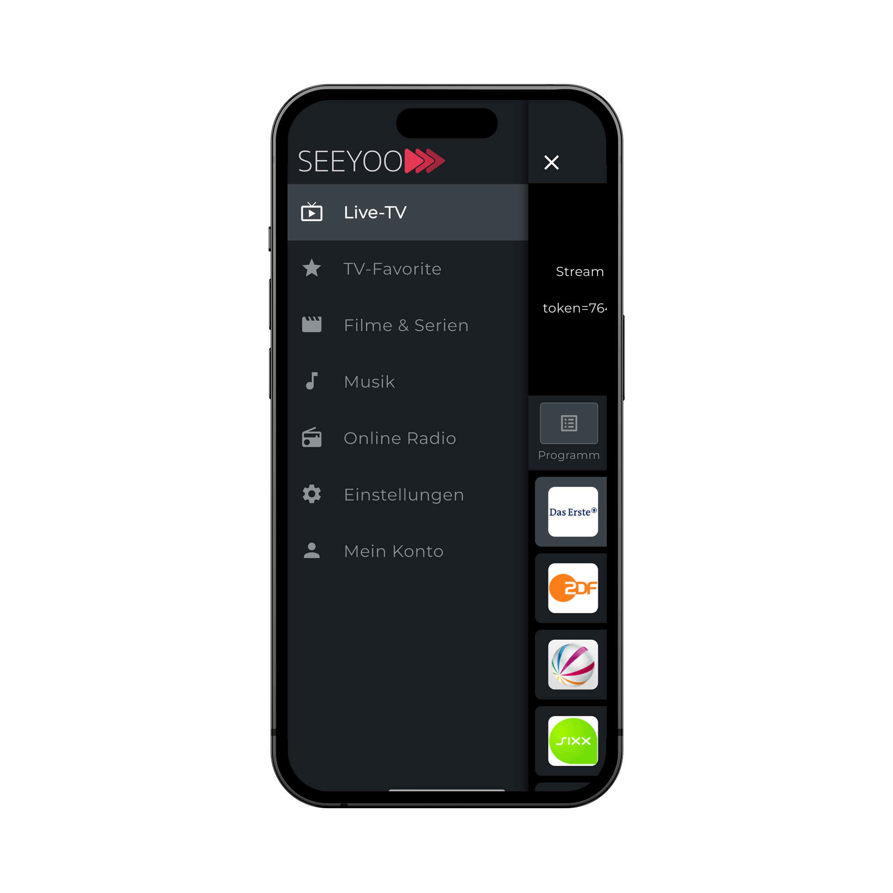

# Sprint 1 Planung - SEEYOO Live-TV App

## Sprint Goal
**"Grundlegende App-Struktur und Benutzeroberfläche für die Live-TV-Streaming-App erstellen und erste Funktionen implementieren, um ein erstes Testen zu ermöglichen."**

## Sprint Dauer
2 Wochen (26.06.2025 - 10.07.2025)

## Sprint Team
- Product Owner: Vitali Mack
- Entwickler: Vitali Mack
- Designer: Vitali Mack

## Ausgewählte PBIs (Product Backlog Items)

### 1. App-Grundgerüst und Navigation (US-5, US-11, US-12)
**Ziel:** Eine stabile App-Grundstruktur mit funktionierender Navigation zwischen den Hauptbildschirmen.

**Tasks:**
- [x] Grundlegende App-Struktur mit Flutter einrichten
- [x] Hauptnavigationsleiste implementieren (TV, Filme/Serien, Musik, Radio, Einstellungen, Mein Konto)
- [x] Bottom Navigation für Hauptbereiche (Programm, Mediathek, Kategorien, Favoriten)
- [x] Splash Screen mit App-Logo
- [x] Ladeanimationen für Seitenübergänge
- [x] Error-Boundaries für stabile Navigation
- [ ] USER_ID API Request Implementation (Damit die user Einstellungen geladen und gespeichert werden. z.B. Favoriten, letzte geschaute Sender, Startlogik - z.B. direkt mit Favoriten starten, etc.) 

### 2. Benutzeroberfläche für Kanalübersicht (US-5, US-6, US-7)
**Ziel:** Eine ansprechende und benutzerfreundliche Übersicht aller verfügbaren Kanäle.

**Tasks:**
- [x] Grundlayout für die Kanalübersicht erstellen
- [x] Kachelansicht für Kanäle implementieren
- [x] Ladeanimation während des Ladens der Kanäle
- [ ] Suchfunktion mit Echtzeit-Vorschlägen (fällt aus)
- [x] Filterfunktion nach Kategorien
- [ ] Fehlerbehandlung bei Verbindungsproblemen (Im nächsten Release)
- [x] Programm Übersicht (EPG-Daten)
- [ ] Mediathek (Aufgenommene Sendungen) - Im nächsten Release
- [x] Kategorien (Sortierung nach Kategorien)
- [ ] Favoriten (Favorisierte Kanäle)

### 3. Basis-Streaming-Funktionalität (US-9, US-11, US-12)
**Ziel:** Grundlegende Wiedergabefunktionen für Live-TV-Streams.

**Tasks:**
- [ ] Integration eines Video-Players (z.B. video_player oder vlc_player)
- [ ] Vollbildmodus mit Steuerelementen
- [ ] Pause/Fortsetzen-Funktion (fällt aus)
- [ ] Automatische Anpassung der Videoqualität
- [ ] Fehlerbehandlung bei Streaming-Problemen

### 4. Benutzerauthentifizierung (US-1, US-2, US-3)
**Ziel:** Sichere Anmeldung und Registrierung für Benutzer.

**Tasks:**
- [x] Registrierungsbildschirm mit E-Mail/Passwort
- [x] Anmeldebildschirm
- [ ] Passwort zurücksetzen Funktion (Im nächsten Release)
- [ ] E-Mail-Verifizierung (Im nächsten Release)
- [ ] Sichere Speicherung von Anmeldedaten

### 5. Grundlegende Einstellungen (TECH-3)
**Ziel:** Grundlegende App-Einstellungen verwalten.

**Tasks:**
- [ ] Einstellungsseite erstellen
- [ ] Dark/Light Mode Umschalter (Im nächsten Release)
- [ ] Sprachauswahl (Deutsch/Englisch) (Im nächsten Release)
- [ ] Benachrichtigungseinstellungen (Im nächsten Release)
- [ ] Datenschutzeinstellungen

## Technische Schwerpunkte
- **Performance-Optimierung** für flüssige Navigation
- **Responsive Design** für verschiedene Bildschirmgrößen
- **Fehlerbehandlung** für stabile Nutzererfahrung
- **Code-Qualität** mit ausreichender Testabdeckung

## Risiken und Herausforderungen
1. **Streaming-Performance** auf verschiedenen Geräten
   - Minderung: Frühzeitiges Testen auf verschiedenen Geräten

2. **API-Verfügbarkeit**
   - Minderung: Mock-Daten für Entwicklungsumgebung vorbereiten

3. **Speicherverbrauch** bei längerer Nutzung
   - Minderung: Optimierung der Bildgrößen und Caching-Strategie

## Erfolgskriterien
- [ ] App stürzt nicht ab bei normaler Nutzung
- [ ] Ladezeiten unter 2 Sekunden
- [ ] Mindestens 70% Testabdeckung der kritischen Pfade
- [ ] Positive Rückmeldungen von Testnutzern zur Bedienbarkeit

## Offene Fragen
- Welche Kanäle sollen in der ersten Version verfügbar sein?
- Gibt es spezielle Anforderungen an die Barrierefreiheit?
- Sollen Werbeinhalte unterstützt werden?

## Nächste Schritte nach Sprint 1
- Nutzerfeedback einholen
- Performance-Analyse durchführen
- Priorisierung für Sprint 2 vornehmen

## Fortschrittsverfolgung
- Tägliche Stand-up Meetings zur Abstimmung
- Wöchentliche Überprüfung der Sprint-Ziele
- Retrospektive am Ende des Sprints

---
## App-Screenshots

<!-- Erstes Bild allein -->

  
  
Startbildschirm

<!-- Zweite Zeile mit zwei Bildern -->

  

    
    
Login-Bildschirm

  

  

    
    
Registrierung

  

<!-- Dritte Zeile mit zwei Bildern -->

  

    
    
Hauptmenü

  

  

    
    
TV-Übersicht

  

---
*Letztes Update: 26.06.2025 - Vitali Mack*

*Abbildung 1: Startbildschirm*

*Abbildung 2: Login-Bildschirm*

*Abbildung 3: Hauptmenü*

*Abbildung 4: TV-Übersicht*

*Abbildung 5: EPG*  

*Abbildung 6: Kategorien*

*Letztes Update: 07.07.2025 - Vitali Mack*

