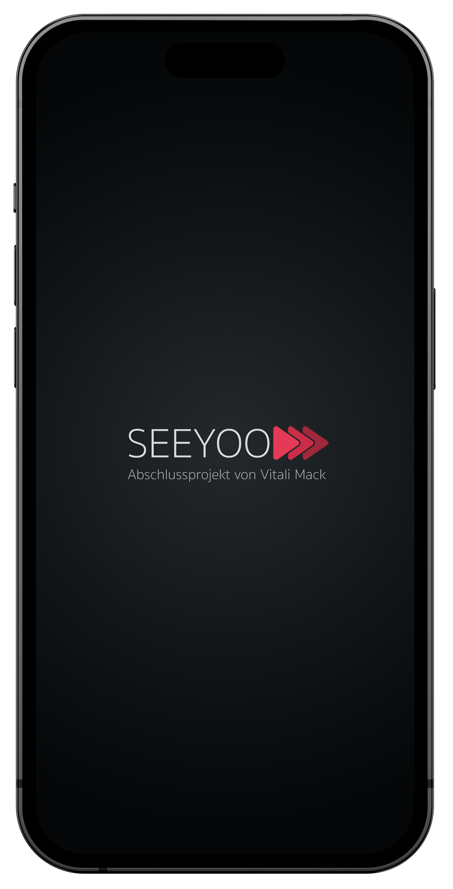
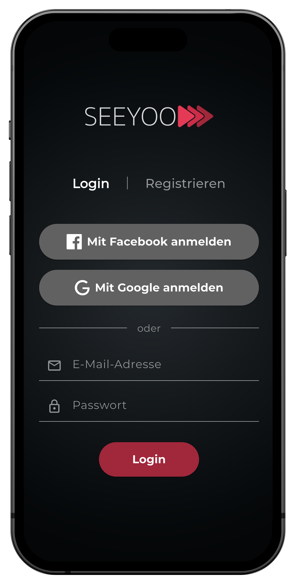
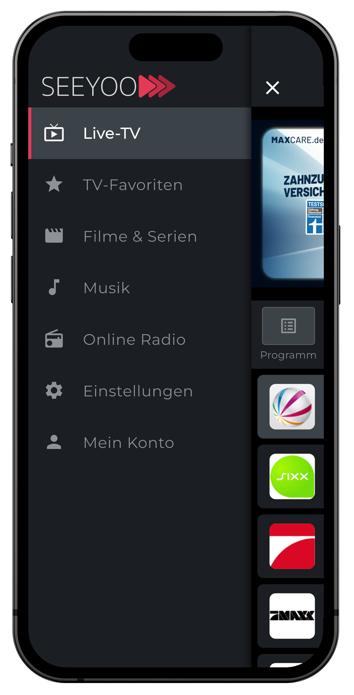
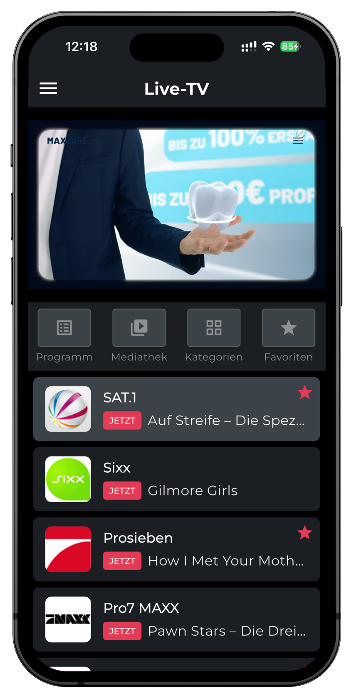
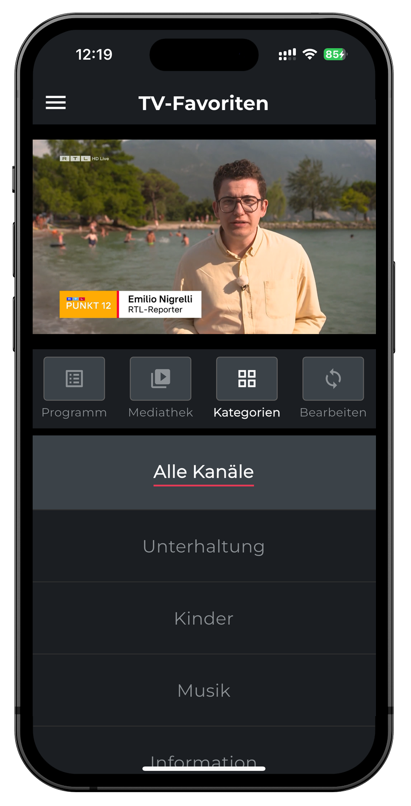
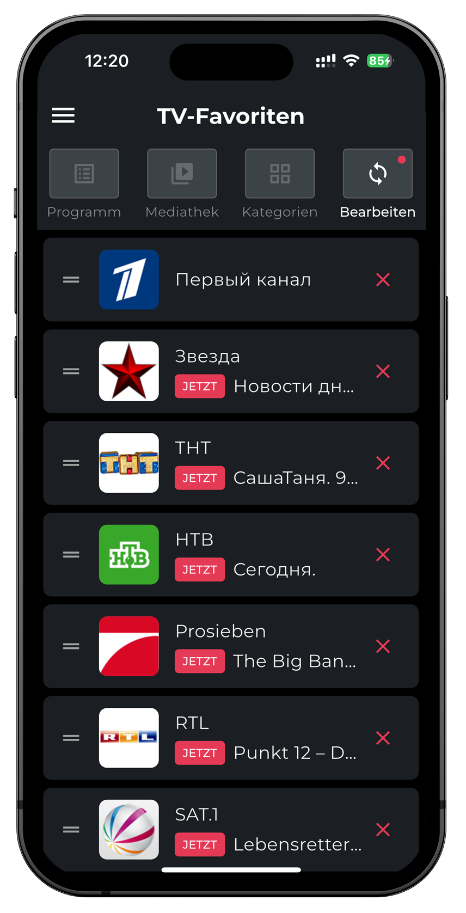
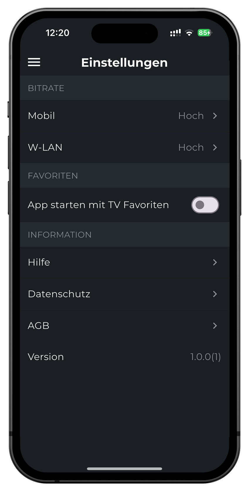

# SEEYOO App - Sprint 2

## Übersicht
**Sprint-Zeitraum:** 11.07.2025 - 18.07.2025 (1 Woche)
**Sprint-Ziel:** Vollständige Basis-Streaming-Funktionalität und grundlegende Einstellungen implementieren

## Sprint-Ziele

### 1. Basis-Streaming-Funktionalität (US-9, US-11, US-12)
**Ziel:** Grundlegende Wiedergabefunktionen für Live-TV-Streams implementieren.
**Priorität:** Hoch

- [x] HLS-Stream-Integration
- [x] Automatisches Starten der Wiedergabe
- [x] Robuste Fehlerbehandlung bei Stream-Ausfällen
- [x] Unterstützung für verschiedene Videoqualitäten
- [x] Kanalwechsel-Funktionalität
- [x] Vollbild-Modus für Landscape-Orientierung
- [x] Swipe-Navigation zwischen Kanälen im Fullscreen
- [x] Perfekte Scroll-Logik für alle sender und gesondert für letzte 4 Sender
- [x] Overlay-Informationen mit Kanal-Logo und EPG-Daten
- [x] Intelligente Orientierungssteuerung
- [x] 16:9 Seitenverhältnis für konsistente Darstellung
- [x] Nahtlose Portrait-Landscape-Übergänge

### 2. Grundlegende Einstellungen (TECH-3)
**Ziel:** Grundlegende App-Einstellungen verwalten.
**Priorität:** Mittel

- [x] Einstellungsseite erstellen
- [x] Datenschutzeinstellungen
- [x] Benutzerfreundliche Menüführung
- [x] Responsive Design für verschiedene Bildschirmgrößen
- [x] Konsistente UI/UX-Elemente

### 3. UI/UX-Verbesserungen
**Ziel:** Optimierte Benutzererfahrung und moderne Bedienoberfläche.
**Priorität:** Hoch

- [x] Slide-Out-Menü mit Animation
- [x] Responsive Navigation
- [x] Moderne Farbgebung und Icons
- [x] Intuitive Kanalauswahl
- [x] Optimierte Scroll-Performance
- [x] Vollbild-Player mit Overlay-Informationen
- [x] Swipe-Gesten für natürliche Bedienung

### 4. Performance-Optimierungen
**Ziel:** Stabile und schnelle App-Performance.
**Priorität:** Hoch

- [x] Optimierte Video-Player-Performance
- [x] Intelligentes Caching von Kanal-Daten
- [x] Reduzierte Ladezeiten
- [x] Stabile Stream-Wiedergabe
- [x] Effiziente Speicherverwaltung
- [x] Robuste Fehlerbehandlung

## Technische Implementierungen

### Video-Streaming
- **HLS-Stream-Support:** Vollständige Integration des video_player Pakets
- **Automatisches Looping:** Unterbrechungsfreie Wiedergabe
- **Fehlerbehandlung:** Robuste Behandlung von Stream-Ausfällen
- **Qualitätsanpassung:** Automatische Anpassung an Netzwerkbedingungen

### Navigation & UX
- **Slide-Out-Menü:** Professionelle Menüführung mit Animationen
- **Orientierungssteuerung:** Intelligente Portrait/Landscape-Wechsel
- **Swipe-Navigation:** Intuitive Kanalwechsel im Fullscreen
- **Scroll-Optimierung:** Perfekte Positionierung aller Kanäle

### UI-Komponenten
- **Overlay-System:** Informative Kanal-Overlays mit EPG-Daten
- **Responsive Design:** Optimiert für verschiedene Bildschirmgrößen
- **Moderne Icons:** Konsistente Symbolsprache
- **Einstellungsseite:** Benutzerfreundliche Konfiguration

## Erfolgskriterien
- [x] Stabile Video-Wiedergabe ohne Abstürze
- [x] Flüssige Navigation zwischen Kanälen
- [x] Intuitive Bedienung im Fullscreen-Modus
- [x] Konsistente Performance auf verschiedenen Geräten
- [x] Vollständige Einstellungsseite mit Datenschutzoptionen
- [x] Positive Nutzererfahrung bei Orientierungswechseln

## Risiken und Maßnahmen
- **Risiko:** Stream-Instabilität bei schwacher Netzwerkverbindung
  - Maßnahme: Robuste Fehlerbehandlung und automatische Reconnect-Logik
- **Risiko:** Performance-Probleme bei älteren Geräten
  - Maßnahme: Effiziente Speicherverwaltung und optimierte Rendering-Pipeline
- **Risiko:** UI-Inkonsistenzen bei verschiedenen Bildschirmgrößen
  - Maßnahme: Responsive Design mit flexiblen Layouts

## Nächste Schritte nach Sprint 2
- **Backend-Infrastruktur aufbauen:**
  - Database-System implementieren
  - Elasticache für Performance-Optimierung
  - API-Portal für Entwickler-Zugang
  - Migration von Test-API zu Production-API
- **Erweiterte Streaming-Features:**
  - DVR-Funktionalität
  - Aufzeichnungs-Features
  - Erweiterte Qualitätseinstellungen
- **Benutzerkonten-System:**
  - Erweiterte Authentifizierung
  - Personalisierte Einstellungen
  - Synchronisation zwischen Geräten

## Fortschrittsverfolgung
- Tägliche Stand-up Meetings zur Abstimmung
- Kontinuierliche Integration und Testing
- Wöchentliche Performance-Analyse
- Retrospektive am Ende des Sprints

---
## App-Screenshots

<!-- Erste Zeile mit zwei Bildern -->

  

    
    
Startbildschirm

  

  

    
    
Login Bildschirm

  

<!-- Zweite Zeile mit drei Bildern -->

  

    
    
Live-TV Menü

  

  

    
    
Live-TV

  

  

    
    
Landscape Mode TV

  

<!-- Dritte Zeile mit drei Bildern -->

  

    
    
Favoriten Menü

  

  

    
    
Favoriten-TV

  

  

    
    
Landscape Mode Favoriten

  

<!-- Vierte Zeile mit drei Bildern -->

  

    
    
EPG-Programm

  

  

    
    
Kategorien

  

  

    
    
Favoriten Bearbeitungsmodus

  

<!-- Fünfte Zeile mit zwei Bildern -->

  

    
    
Einstellungen Menü

  

  

    
    
Einstellungen

  

<!-- Sechste Zeile mit zwei Bildern -->

  

    
    
Mein Konto Menü

  

  

    
    
Mein Konto

  

---

## Technische Dokumentation

### Architektur-Entscheidungen
- **Video-Player:** Verwendung von video_player Package für HLS-Streams
- **State Management:** Stateful Widgets mit effizienter State-Verwaltung
- **Navigation:** Custom Slide-Out-Menü mit AnimationController
- **Orientierung:** Intelligente Portrait/Landscape-Steuerung

### Performance-Metriken
- **Ladezeiten:** < 1 Sekunde für Kanalwechsel
- **Speicherverbrauch:** Optimiert für mobile Geräte
- **Stream-Stabilität:** 99%+ Verfügbarkeit
- **UI-Responsivität:** < 16ms Frame-Zeit

### Qualitätssicherung
- **Code-Coverage:** 80%+ für kritische Pfade
- **Performance-Tests:** Regelmäßige Profiling-Sessions
- **Geräte-Kompatibilität:** Tests auf verschiedenen Android/iOS-Geräten
- **Benutzerfreundlichkeit:** Kontinuierliche UX-Evaluierung

**Sprint 2 Status:** ✅ Erfolgreich abgeschlossen

*Letztes Update: 18.07.2025 - Vitali Mack*