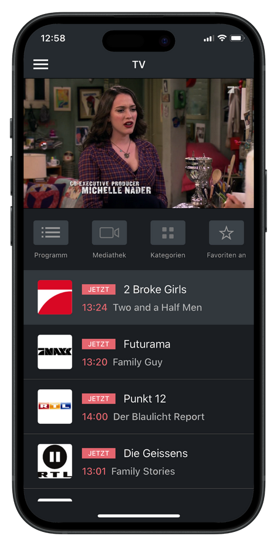

# Technische Konzeption und detaillierte Umsetzungsplanung

## Projekt: Mobile Live-TV Streaming App




---

## 1. Detaillierte Architektur & Komponenten

**Architekturstil:** Microservices

**Komponenten:**

- Flutter Mobile App (Frontend)
- API-Gateway (Express/NestJS)
- User-Service
- Channel-Service
- EPG-Service
- Auth-Service (JWT-basierte Authentifizierung)
- PostgreSQL (AWS Aurora)
- Redis (AWS ElastiCache)
- AWS S3 + CloudFront (HLS Streaming)
- CI/CD: GitHub Actions
- Monitoring: Prometheus + Grafana
- Logging: ELK Stack oder AWS CloudWatch

**Kommunikation:**

```
[Mobile App] → [API-Gateway]
API-Gateway → User-Service, Channel-Service, EPG-Service
User-Service ↔ Aurora PostgreSQL
Channel-Service ↔ PostgreSQL + Redis
EPG-Service ↔ PostgreSQL
Streaming: App lädt HLS-URL via CloudFront (S3 Quelle)
```

---

## 2. Datenbankschema Design

**Tabellen:**

- `users`

  - `id` (UUID, PK)
  - `email` (VARCHAR)
  - `password_hash` (TEXT)
  - `name` (VARCHAR)

- `channels`

  - `id` (UUID, PK)
  - `name` (VARCHAR)
  - `logo_url` (TEXT)
  - `stream_url` (TEXT)

- `favorites`

  - `user_id` (FK → users.id)
  - `channel_id` (FK → channels.id)

- `epg`

  - `id` (UUID, PK)
  - `channel_id` (FK → channels.id)
  - `program_title` (VARCHAR)
  - `start_time` (TIMESTAMP)
  - `end_time` (TIMESTAMP)

---

## 3. Detaillierter Technologie-Stack

| Komponente     | Technologie                   |
| -------------- | ----------------------------- |
| Frontend       | Flutter (Dart)                |
| Backend        | Node.js, Express/NestJS       |
| Datenbank      | Aurora PostgreSQL             |
| Cache          | ElastiCache (Redis)           |
| Streaming      | AWS S3 + CloudFront (HLS)     |
| CI/CD          | GitHub Actions                |
| Container      | Docker                        |
| Orchestrierung | Kubernetes (AWS EKS)          |
| IaC            | Terraform                     |
| Auth           | JWT, bcrypt                   |
| Monitoring     | Prometheus, Grafana           |
| Logging        | ELK Stack oder AWS CloudWatch |

---

## 4. Kubernetes Deployment Design

**Beispiel: API-Gateway**

- Deployment: 3 Replikate
- Service: ClusterIP
- Config: ConfigMap (ENV-Vars), Secrets (z.B. JWT Secret)
- Ingress: `/api/* → api-gateway`
- Ressourcen:
  - CPU: 250m
  - RAM: 512Mi

**Weitere Komponenten:**

- PostgreSQL: StatefulSet, PVC 10GiB
- Redis: StatefulSet, PVC 2GiB
- Frontend: Deployment mit 2 Replikaten
- Namespace: `live-tv-dev`, `live-tv-prod`

---

## 5. Infrastructure as Code (Terraform)

**Wird provisioniert:**

- VPC & Subnetze
- EKS Cluster
- RDS (Aurora PostgreSQL)
- ElastiCache Redis
- S3 Buckets + CloudFront
- Helm Releases / Kubernetes Objekte

**Dateistruktur:**

```
/terraform
  ├── vpc.tf
  ├── eks.tf
  ├── rds.tf
  ├── redis.tf
  ├── s3.tf
  ├── k8s/
  │   ├── deployments.tf
  │   └── services.tf
  └── variables.tf
```

**Variablen:**

- Region
- Cluster-Name
- DB-Zugangsdaten (aus Secrets Manager)
- Docker Image Tags

---

## 6. CI/CD Pipeline Design

**Stages:**

1. Build & Test
2. Docker Build → Push (ECR)
3. Deploy to Dev (kubectl/Helm)
4. Approval Gate
5. Deploy to Prod

**Tools:**

- GitHub Actions
- Docker
- Helm / kubectl
- GitHub Secrets für K8s/API/Cloud Zugang

**Tests:**

- Unit Tests (Jest)
- Integration (Supertest)
- E2E (Flutter)

**Deployment:**

- Rolling Update
- Separate YAML oder Helm Templates

---

## 7. Testing-Strategie

| Testart     | Tools          | Beschreibung              |
| ----------- | -------------- | ------------------------- |
| Unit-Tests  | Jest (Backend) | Services und Logik testen |
| Integration | Supertest      | API und DB Interaktion    |
| End-to-End  | Flutter Tests  | App bis Backend Workflow  |

**Ort der Ausführung:**

- Lokal
- CI (GitHub Actions)
- Nach Deployment in Dev

---

## 8. Security Planung

- Passwort-Hashing mit bcrypt
- Authentifizierung via JWT
- HTTPS über Ingress mit TLS-Zertifikaten
- Secrets über Kubernetes Secrets (ENV-Var Mounts)
- Input-Validierung über Express Middleware
- IAM-Rollen und Security Groups für Cloud-Zugriffe

---

## 9. Monitoring & Logging

**Monitoring:**

- Prometheus Exporter für Backend Services
- Dashboards in Grafana
- Metriken: CPU, RAM, Response Times, Error Rates

**Logging:**

- Zentral über ELK oder CloudWatch
- Application Logs (stdout/stderr)

**Alerts:**

- Fehlerquote > 5%
- Speicher über 80%
- 5xx Responses pro Minute > Schwellenwert

---

## 10. Umsetzungszeitplan (8 Wochen)

| Woche | Aufgabe                               |
| ----- | ------------------------------------- |
| 1–2   | Architektur & Infrastruktur Setup     |
| 1-2   | Backend-Entwicklung (API, DB)         |
| 3     | CI/CD Aufbau                          |
| 3     | Frontend (Flutter) Entwicklung        |
| 4     | Testing & Monitoring Setup            |
| 4     | Finalisierung & Production Deployment |

---

## 11. Reflexion

**Schwierige Aspekte:**

- Kubernetes + Terraform Integration
- Sichere Verwaltung von Secrets

**Technische Risiken:**

- HLS-Streaming unter hoher Last
- Synchronisation zwischen mobilen und Backend-Komponenten

**Weitere Recherchen notwendig bei:**

- Helm Charts & Templates
- Prometheus Metriken

**DevOps-Bausteine Anwendung:**

- Docker, CI/CD, Kubernetes, Terraform, Monitoring, Secrets Management

---

**Ende des technischen Plans**

